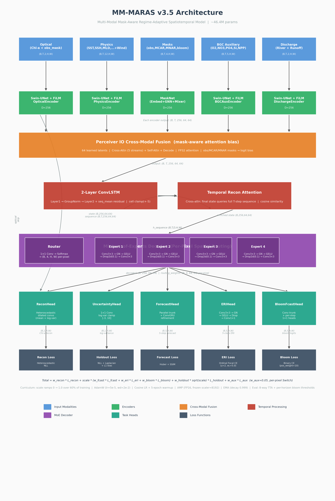

# MM-MARAS

**Multi-Modal Mask-Aware Regime-Adaptive Spatiotemporal Model**

MM-MARAS is a deep learning system for Bay of Bengal chlorophyll-a (Chl-a) reconstruction, 5-step forecasting, pixel-level uncertainty estimation, algal bloom early warning, and ecosystem risk assessment. It fuses five heterogeneous input streams through a Perceiver IO cross-attention module, processes the temporal sequence with a two-layer ConvLSTM, and decodes through a soft-routing Mixture-of-Experts decoder.

The project has two parts: a preprocessing pipeline that downloads, aligns, normalizes, and patches multi-source oceanographic data, and a PyTorch model (~46.4M parameters) that consumes those patches.

## Results (v3.5 — current)

Trained on 1,264 patches from the Bay of Bengal (2021-2024), evaluated on 260 test patches (2024-2025). Training: 2x T4 GPUs with DDP + AMP, batch size 4 per GPU, 60 epochs at lr=5e-5 (best EMA checkpoint at epoch 47, val loss -1.3790, 0 AMP scaler skips after warmup). EMA decay 0.999. Peak VRAM: ~8.1 GB per T4 GPU. Wall time: ~10.4 h. Evaluation uses 8-way TTA (4 rotations × H-flip), per-horizon bloom thresholds (0.90 across all 5 horizons), and gap-bias correction (+0.1989).

### Reconstruction

| Subset | Pixels | RMSE | MAE | Bias | R² | SSIM |
|---|---|---|---|---|---|---|
| All ocean | 1,031,940 | 0.1847 | 0.0782 | -0.0130 | 0.808 | 0.847 |
| Valid (observed) | 848,900 | 0.0815 | 0.0308 | +0.0136 | 0.969 | 0.832 |
| Gap (missing) | 183,040 | 0.4020 | 0.2983 | -0.1361 | -- | 0.000 |

CRPS: 0.0603.

### Forecast

| Horizon | RMSE | MAE | SSIM |
|---|---|---|---|
| +1 day | 0.1025 | 0.0382 | 0.940 |
| +2 days | 0.1311 | 0.0483 | 0.877 |
| +3 days | 0.1556 | 0.0576 | 0.831 |
| +4 days | 0.1721 | 0.0649 | 0.791 |
| +5 days | 0.1838 | 0.0709 | 0.758 |

### ERI classification

Accuracy: 0.9994. Macro F1: 0.926. Ordinal MAE: 0.001. Per-class F1: class 0 = 1.000, class 1 = 0.634, class 2 = 1.000, class 3 = 0.998, class 4 = 0.999.

### Bloom lead-time prediction

| Horizon | Precision | Recall | F1 |
|---|---|---|---|
| +1 day | 0.841 | 0.886 | 0.863 |
| +2 days | 0.816 | 0.864 | 0.840 |
| +3 days | 0.798 | 0.843 | 0.820 |
| +4 days | 0.784 | 0.825 | 0.804 |
| +5 days | 0.776 | 0.811 | 0.793 |

Macro F1: 0.824. Bloom rate: ~1.18% of ocean pixels. Per-horizon thresholds calibrated at 0.90 (vs default 0.5 which gives Macro F1 0.741).

### Uncertainty calibration

ECE: 0.0447. Variance-error correlation: 0.488.

### MoE routing

Expert utilization: 1.0000. Routing entropy: 1.386 / 1.386 (maximum). Expert weights: 25.00%, 25.02%, 24.97%, 25.01%. Per-pixel spatial routing distributes load uniformly across the 4 experts.

### Ecosystem impact

Mean: 0.178. P90: 0.298. P95: 0.403. High-impact fraction (score > 0.6): 2.64% of ocean pixels.

### Version history

<details>
<summary>v2 → v3.5 metric progression</summary>

| Metric | v2 | v3.2 | v3.4 | v3.5 |
|---|---|---|---|---|
| Valid RMSE | 0.102 | 0.127 | 0.137 | **0.082** |
| Valid R² | 0.952 | 0.925 | 0.912 | **0.969** |
| Valid SSIM | -- | -- | 0.418 | **0.832** |
| Gap RMSE | -- | -- | 0.834 | **0.402** |
| Forecast +1 RMSE | 0.132 | 0.249 | 0.196 | **0.103** |
| Forecast +1 SSIM | 0.889 | 0.488 | 0.710 | **0.940** |
| Forecast +5 RMSE | -- | -- | 0.219 | **0.184** |
| Bloom Macro F1 | -- | 0.620 | 0.749 | **0.824** |
| ERI Macro F1 | 0.687 | 0.335 | 0.521 | **0.926** |
| CRPS | 0.023 | 0.079 | 0.073 | **0.060** |
| Params | ~42M | ~43M | ~44.4M | **~46.4M** |

v3.2 introduced FP16 stability fixes (FP32 attention, activation clamps, GradScaler frozen at 8192). v3.3 added dropout + anti-overfitting changes (too aggressive — bloom F1 collapsed to 0.000). v3.4 dialed back to the optimal balance. v3.5 added FiLM regime-adaptive normalization, mask-aware attention bias, heteroscedastic recon head, ordinal focal CE for ERI, per-pixel spatial MoE routing with Switch aux loss, EMA weight tracking, 8-way TTA, MC-dropout epistemic uncertainty, and per-horizon bloom thresholds.

</details>

## Model outputs

Given a temporal patch of 10 satellite and environmental time steps, the model predicts:

| Output | Shape | Description |
|---|---|---|
| `recon` | `(B, 1, H, W)` | Gap-filled Chl-a for the last input time step |
| `forecast` | `(B, 5, H, W)` | Chl-a predictions for the next 5 time steps |
| `uncertainty` | `(B, 1, H, W)` | Per-pixel log-variance (aleatoric uncertainty) |
| `eri` | `(B, 5, H, W)` | Ecosystem Risk Index ordinal logits (5 levels: 0-4) |
| `bloom_forecast` | `(B, 5, H, W)` | Per-step bloom probability logits |
| `routing_weights` | `(B, 4)` | MoE expert blend weights (training only) |
| `holdout_mask` | `(B, H, W)` | Pixels held out for gap-filling supervision (training only) |

Additionally, `compute_ecosystem_impact()` derives a per-pixel 0-1 ecosystem impact score by combining bloom probability, forecast intensity, uncertainty, and coastal proximity.

## Architecture



```
optical (chl_obs + obs_mask)      --> OpticalEncoder   (Swin-UNet, 2ch)  --\                                          skip to ReconHead
physics + wind + static          --> PhysicsEncoder    (Swin-UNet, 12ch) --\                                               |
masks (obs/mcar/mnar/bloom)      --> MaskNet           (GNN + temporal)  --> FusionModule --> TemporalModuleV3 --> TemporalReconAttn --> MoEDecoder --> Heads
bgc_aux                          --> BGCAuxEncoder     (Swin-UNet, 5ch)  --/   (Perceiver IO)  (ConvLSTM x2)      (4-head cross-attn)   (4 experts)
discharge                        --> DischargeEncoder  (Swin-UNet, 2ch)  --/
```

**Encoders.** All four spatial encoders reuse the same Swin-UNet backbone (patch embed, 3-stage encoder, bottleneck, 3-stage decoder with skip connections) with independent weights. Gradient checkpointing wraps each encoder's forward pass to trade compute for ~40% activation memory savings. Stage dimensions: 64, 128, 256; window sizes: 8, 8, 4. The physics encoder concatenates ocean state (6ch), wind/atmosphere (4ch), and static context (2ch, broadcast over time) into 12 channels. FiLM regime-adaptive normalization (v3.5) conditions the encoder stem on wind/discharge/temporal physics covariates, so the model can specialize on seasonal regimes without splitting experts. MaskNet classifies pixels into five missingness types via learned embeddings, propagates context through two rounds of masked grid-graph convolution, and mixes across time with depthwise temporal convolution.

**Fusion.** Perceiver IO with 64 latent queries cross-attending to spatially pooled tokens from all five streams (1280 KV tokens). Cross-attention uses FP32 for numerical stability under AMP and mask-aware attention bias (v3.5) pipes observation/MCAR/MNAR masks into attention logits as additive bias, preventing cloud-masked pixels from corrupting spatial attention. Self-attention refinement, then decode back to full resolution via position-aware spatial queries with residual blend. Activation clamping (±50) after each residual addition prevents overflow.

**Temporal.** Two stacked ConvLSTM layers. Layer 1 returns the full hidden sequence (B, T, D, H, W); layer 2 processes it with GroupNorm-normalized global-context bias to produce the final state (B, D, H, W). Cell states clamped to ±5.0 to prevent FP16 overflow. The final state is enriched via TemporalReconAttention: 4-head cross-attention from the last-timestep query to the full layer-1 sequence, using cosine similarity with learnable temperature, L2-normalized Q/K, and obs_mask-weighted spatial pooling. Gap pixels at the last timestep attend to previously observed timesteps to recover context lost during temporal encoding.

**Decoder.** Four expert ConvNets (Conv3×3 → GroupNorm → GELU → Dropout2d(0.1) → Conv3×3) soft-blended **per pixel** (v3.5) via spatial routing (1×1 conv → softmax over 4 experts, applied at every spatial location). Switch Transformer load-balancing auxiliary loss at weight 0.05. Per-pixel routing replaces the v3.4 per-sample global routing, letting different regions of a single patch attend to different experts.

**Heads.** All heads use Dropout2d(0.2) for regularization. Reconstruction: mask-conditioned spatial head — fuses decoded features, optical encoder skip connection, and obs_mask (D×2+1 channels), then 4 dilated convolutions (dilation 1, 2, 4, 8; 25×25 effective receptive field), then 1×1 projection to **mean + log-variance** (heteroscedastic, v3.5) trained with proper NLL recon loss. Forecast: two-stage — (1) parallel prediction via shared 2-layer trunk + per-step projections, then (2) autoregressive ConvGRU refinement unrolled over 5 steps (D//4 channels, corrections clamped to [-1, 1]). Uncertainty: 1×1 conv, output clamped to [-3, 10]. ERI: predicts from decoded features only (no label leakage); Conv2d(D → D//2 → 5) with GroupNorm + Dropout2d, trained with ordinal focal CE (v3.5) for the 0.03%–99.85% class skew. Bloom forecast: shared trunk + per-step binary outputs. Total: ~46.4M parameters.

**Architectural evolution.** Key changes from v2:
- [A] ReconHead: dilated convolutions conditioned on `obs_mask` with optical encoder skip connection (was 1×1 conv)
- [B] Temporal recon attention: cross-attends to full ConvLSTM hidden sequence (recovers context for gap pixels)
- [C] Autoregressive forecast refinement: ConvGRU refines each step conditioned on previous prediction
- [D] ERI head predicts from learned features only (v3.1 removed bloom_count input that caused label leakage)
- [E] FP16 stability: FP32 attention matmul, activation clamping, frozen GradScaler at 8192 (v3.2)
- [F] Regularization: Dropout2d(0.2) in all heads, Dropout2d(0.1) in MoE experts (v3.3/v3.4)
- [G] FiLM regime-adaptive normalization in encoder stem (v3.5)
- [H] Mask-aware attention bias in Perceiver fusion (v3.5)
- [I] Heteroscedastic recon head with predicted variance, trained with NLL (v3.5)
- [J] Ordinal focal CE for ERI classification (v3.5)
- [K] Per-pixel spatial MoE routing with Switch aux loss (v3.5)
- [L] EMA weight tracking (decay 0.999), 8-way TTA, MC-dropout epistemic uncertainty, per-horizon bloom thresholds (v3.5)

## Repository layout

```
sea-you-again/
├── data-preprocessing-pipeline/
│   ├── pipeline.py           Main orchestration script
│   ├── config.py             All settings, paths, variable lists, norm stats
│   ├── loader.py             Format detection, downloaders (CMEMS, CDS, CEMS)
│   ├── aligner.py            Coordinate standardization, regridding, time alignment
│   ├── masker.py             Observation, land, bloom, MCAR, MNAR mask generation
│   ├── normalizer.py         log1p, z-score, min-max normalization
│   ├── patcher.py            Spatiotemporal patch extraction, train/val/test split
│   ├── dataset.py            PyTorch Dataset + DataLoader factory
│   └── data/
│       ├── raw/              Downloaded source files
│       ├── patches/
│       │   ├── train/        train_000000.npz ... (1,264 patches)
│       │   ├── val/          val_000000.npz ...   (260 patches)
│       │   └── test/         test_000000.npz ...  (260 patches)
│       └── stats/
│           └── norm_stats_bay_of_bengal.json
├── model/
│   ├── model.py              Top-level MARASSModel + ModelConfig + output heads
│   ├── masknet.py            MaskNet: missingness type embedding + grid GNN + temporal mixer
│   ├── fusion.py             Perceiver IO cross-modal fusion (5 streams)
│   ├── temporal.py           Two-layer ConvLSTM temporal module
│   ├── moe_decoder.py        Soft-routing Mixture-of-Experts decoder (4 experts)
│   ├── augment.py            Spatial data augmentation (flips + 90° rotations)
│   ├── loss.py               MARASSLoss: 6 loss terms with curriculum scheduling
│   ├── calibrate.py          Post-hoc calibration: gap bias correction + bloom threshold optimization
│   ├── check_threshold.py    Bloom threshold utilities
│   └── encoders/
│       ├── optical_encoder.py    Swin-UNet backbone (shared architecture for all spatial encoders)
│       ├── physics_encoder.py    Ocean state + wind + static encoder (12ch input)
│       ├── bgc_encoder.py        BGC auxiliary encoder (o2, no3, po4, si, nppv)
│       └── discharge_encoder.py  River discharge + runoff encoder (dis24, rowe)
├── scripts/
│   ├── Train.py              Training loop (single-GPU, DDP, AMP, curriculum, early stopping)
│   ├── eval.py               Test-set evaluation, bloom forecast metrics, ecosystem impact
│   └── architecture_diagram.py  Generate model architecture diagram
└── figures/
    └── architecture.png      MM-MARAS v3.5 architecture diagram
```

---

## Preprocessing pipeline

### Domain

**Bay of Bengal** (IHO S-23 definition): 79.5-95.5°E, 5.5-22.5°N. Temporal coverage: 2021-01-01 to 2025-12-31 (5 years, daily).

### Data sources

| Stream | Product | Resolution | Variables |
|---|---|---|---|
| BGC Chl-a + nutrients | CMEMS `GLOBAL_MULTIYEAR_BGC_001_029` | 0.25°, daily | chl, o2, no3, po4, si, nppv |
| Ocean physics | CMEMS `GLOBAL_MULTIYEAR_PHY_001_030` | 0.083°, daily | thetao, uo, vo, mlotst, zos, so |
| Atmosphere | ERA5 `derived-era5-single-levels-daily-statistics` | 0.25°, daily | u10, v10, msl (daily mean), tp (daily sum) |
| Freshwater | GloFAS `cems-glofas-historical` | 0.05°, daily | dis24 (discharge), rowe (runoff) |
| Bathymetry | GEBCO 2025 Global Grid | 15 arc-second | elevation (negative = ocean) |

All modalities are regridded to the BGC 0.25° grid via bilinear interpolation. Discharge and precipitation use conservative regridding when xesmf is available. Time axes are aligned to the Chl-a reference.

### Pipeline steps

1. **Download** raw data from CMEMS, CDS, and CEMS (resumable)
2. **Load and align**: standardize coordinates, clip to domain, extract surface level, resample sub-daily to daily, regrid to BGC grid, align time axes
3. **Build masks**: obs_mask, land_mask, bloom_mask (10 mg/m³ threshold), mcar_mask, mnar_mask
4. **Normalize**: log1p + z-score for skewed variables, plain z-score for Gaussian variables, min-max for static context. Statistics from training split only.
5. **Build static context**: bathymetry + distance-to-coast, min-max normalized
6. **Extract patches**: (T=10, H=64, W=64) windows, stride 32, 5-step forecast horizon, 70/15/15 temporal split

### Running the pipeline

```bash
python pipeline.py --bathy data/raw/gebco_2025_n22.5_s5.5_w79.5_e95.5.nc
```

Skip downloads: add `--no-download` with `--chl`, `--physics`, `--era5-wind`, `--discharge` paths. Reuse stats: add `--load-stats`.

### Authentication

CMEMS: `copernicusmarine login`. CDS: `~/.cdsapirc` with API key.

### Installation (pipeline)

```bash
pip install copernicusmarine cdsapi xarray netCDF4 numpy scipy dask pandas torch
```

Optional: `pip install xesmf` for conservative regridding.

---

## Model

### Input contract

| Key | Shape | Description |
|---|---|---|
| `chl_obs` | `(B, 10, 64, 64)` | Log Chl-a, NaN-filled with 0.0 |
| `obs_mask` | `(B, 10, 64, 64)` | 1 = valid observed pixel |
| `mcar_mask` | `(B, 10, 64, 64)` | 1 = missing completely at random |
| `mnar_mask` | `(B, 10, 64, 64)` | 1 = missing not at random |
| `bloom_mask` | `(B, 10, 64, 64)` | Bloom event labels |
| `physics` | `(B, 10, 6, 64, 64)` | thetao, uo, vo, mlotst, zos, so |
| `wind` | `(B, 10, 4, 64, 64)` | u10, v10, msl, tp |
| `static` | `(B, 2, 64, 64)` | Bathymetry, distance-to-coast |
| `discharge` | `(B, 10, 2, 64, 64)` | dis24, rowe |
| `bgc_aux` | `(B, 10, 5, 64, 64)` | o2, no3, po4, si, nppv |

### Losses

Six loss terms with curriculum scheduling (secondary losses ramped from 0 → 1.0 over the first 60% of training). All losses computed in FP32 under AMP. Per-component clamping at 5.0 prevents outlier batches from corrupting optimizer moments.

| Loss | Weight | Description |
|---|---|---|
| Reconstruction | 1.0 | Heteroscedastic NLL on observed ocean pixels (log_var floor -3) |
| Holdout recon | 0.8 | NLL + Laplacian gradient matching + L1 bias on held-out pixels |
| Forecast | 0.5 | Masked Huber (delta=0.5) + SSIM (weight 0.2) over forecast window |
| ERI | 0.3 | Ordinal focal cross-entropy (gamma=2.0, class 1 weight 5.0) |
| Bloom forecast | 0.3 | Binary CE with pos_weight=10 per forecast step |
| MoE auxiliary | 0.05 | Load-balancing (Switch Transformer, per-pixel) |

### Data augmentation

Random flips (horizontal p=0.5, vertical p=0.5) and 90° rotations (p=0.5) applied consistently across all batch tensors during training. Gives up to 8x effective data diversity.

### Training

**v3.5 (current):**

```bash
torchrun --nproc_per_node=2 --standalone scripts/Train.py \
    --patch-dir data-preprocessing-pipeline/data/patches \
    --ckpt-dir checkpoints \
    --batch-size 4 --epochs 60 --warmup-epochs 5 \
    --lr 5e-5 --weight-decay 2e-2 \
    --ema-decay 0.999 --w-aux 0.05 --bloom-oversample 3
```

Single-phase training: lr=5e-5, weight_decay=2e-2, cosine LR with 5-epoch linear warmup. EMA of model weights (decay 0.999) tracked in parallel; `best_ema.pt` is the canonical evaluation checkpoint. GradScaler frozen at init_scale=8192 (growth_interval=100,000 exceeds total steps). Best EMA checkpoint typically at epoch 40-50 (val plateaus ~epoch 40 — 45 epochs is enough if you want to save wall time). Peak VRAM: ~8.1 GB per T4 GPU with AMP and gradient checkpointing. ~540 seconds per epoch on 2×T4; ~10.4 h total for 60 epochs.

### Post-hoc calibration and evaluation

Run calibration first (on val set), then evaluation (on test set) with the calibrated values:

```bash
# Step 1: Calibrate — finds gap bias and per-horizon bloom thresholds
python model/calibrate.py \
    --ckpt checkpoints/best_ema.pt \
    --patch-dir data-preprocessing-pipeline/data/patches \
    --out-dir calibration_results

# Step 2: Evaluate — pass calibrated values from step 1, enable TTA
python scripts/eval.py \
    --ckpt checkpoints/best_ema.pt \
    --patch-dir data-preprocessing-pipeline/data/patches \
    --out-dir eval_results \
    --gap-bias <VALUE_FROM_CALIBRATE> \
    --bloom-thresholds <t1> <t2> <t3> <t4> <t5> \
    --tta
```

**Gap bias correction**: The model systematically over-predicts on gap (cloud-masked) pixels. `calibrate.py` measures the mean bias on the validation set; `eval.py --gap-bias` subtracts it from gap predictions at inference. The bias varies per model version — always re-calibrate after retraining.

**Per-horizon bloom thresholds** (v3.5): `calibrate.py` sweeps both pooled and per-horizon thresholds (0.10–0.95 step 0.05) and returns the 5 values that maximize F1 per forecast step. The v3.5 run converged to 0.90 across all horizons, raising Macro F1 from 0.741 (default 0.5) to 0.824. Pass them to `eval.py` as `--bloom-thresholds t1 t2 t3 t4 t5`.

**Test-time augmentation** (v3.5): `eval.py --tta` runs 8 augmentations (4 rotations × H-flip), inverts the spatial outputs, and averages in native space. ~8× eval latency but removes horizon-to-horizon SSIM wobble and improves all accuracy metrics.

**MC-dropout epistemic uncertainty** (v3.5, optional): `eval.py --mc-dropout N` runs N stochastic forward passes with dropout layers enabled at eval time, reporting `recon_std` and `forecast_std` as epistemic uncertainty alongside the aleatoric variance head.

Outputs: `metrics.json` (includes `tta`, `mc_dropout`, `bloom_thresholds`, `gap_bias`, `mc_dropout_epistemic` fields), `confusion_matrix.csv`, `calibration.csv`, and `figures/` containing reconstruction panels, forecast panels, bloom probability + ecosystem impact maps, calibration diagram, and routing bar chart.

### Smoke tests

```bash
python model/model.py        python model/loss.py          python model/augment.py
python model/fusion.py       python model/temporal.py      python model/moe_decoder.py
python model/masknet.py      python model/encoders/optical_encoder.py
python model/encoders/physics_encoder.py   python model/encoders/bgc_encoder.py   python model/encoders/discharge_encoder.py
```

---

## Bloom early warning and ecosystem impact analysis

### Bloom lead-time prediction

The `BloomForecastHead` predicts bloom probability at each of the 5 forecast steps (t+1 through t+5 days). Trained with binary cross-entropy (pos_weight=10 for extreme bloom rarity, ~1.2% positive rate). Targets derived from forecast Chl-a exceeding the bloom threshold (2.5 in normalized z-score space).

```python
bloom_probs = torch.sigmoid(outputs["bloom_forecast"])  # (B, 5, H, W)
# bloom_probs[:, 0] = P(bloom at +1 day)
# bloom_probs[:, 4] = P(bloom at +5 days)
```

### Ecosystem impact scoring

Post-processing function combining four model outputs:

| Component | Weight | Source |
|---|---|---|
| Bloom severity | 0.40 | Max bloom probability across 5 steps |
| Chl-a intensity | 0.25 | Max forecast Chl-a (tanh-saturated) |
| Coastal proximity | 0.20 | 1 - distance_to_coast |
| Uncertainty flag | 0.15 | Sigmoid of log-variance |

```python
from model import compute_ecosystem_impact
impact = compute_ecosystem_impact(
    torch.sigmoid(outputs["bloom_forecast"]),
    outputs["forecast"], outputs["uncertainty"],
    batch["static"], batch["land_mask"],
)  # (B, H, W) in [0, 1]
```

### Interpreting outputs

A single inference pass produces: bloom probability timeline (5 maps, one per future day), ecosystem impact map (values above 0.6 indicate high risk), uncertainty map (high uncertainty near bloom threshold is a warning signal), and ERI classification (5-level ordinal risk: none/low/moderate/high/extreme).

---

## Notes

- Training loss goes negative because heteroscedastic NLL drives below zero with well-calibrated uncertainty. This is expected.
- 30% of observed pixels are held out via structured elliptical cloud gaps during training for gap-filling supervision.
- Validation gap RMSE uses a deterministic holdout mask (SHA-1 hash seed) for reproducibility.
- `eval.py` forces routing weight collection in eval mode for post-training analysis.
- The optical encoder supports optional SatMAE weight initialization via `load_satmae_patch_embed()`.
- The contrastive pre-alignment loss in `fusion.py` is available for an optional pretraining phase.
- All pipeline downloads are resumable. Normalization statistics are training-split-only.
- Checkpoint compatibility: v2 ≠ v1 (new heads), v3 ≠ v2 (new ReconHead, ForecastHead, ERIHead, TemporalModuleV3), v3.2 ≠ v3.1 (seq_norm GroupNorm added). v3.3/v3.4 are weight-compatible with v3.2 (hyperparameter changes only). **v3.5 ≠ v3.4**: FiLM layers in encoder stem, mask-aware attention bias in fusion, heteroscedastic recon head (mean + log-var), per-pixel spatial MoE router, and EMA tracking are new architectural parameters.
- `best_ema.pt` (EMA weights) is the canonical v3.5 evaluation checkpoint, not `best.pt`. EMA typically tracks val loss 0.01–0.05 better than the raw weights.
- MoE routing uniformity at Utilisation=1.0000 with per-pixel routing is expected — each pixel picks its preferred expert, and the uniform batch average comes from even spatial distribution. To verify experts are actually specialized (not collapsed), inspect per-pixel routing variance, not batch-mean weights.
- Gap SSIM ≈ 0 is a metric limitation, not a model failure: gap pixels are scattered (cloud-masked) with no spatial structure for SSIM to measure. Gap RMSE and MAE are the meaningful gap quality metrics.
- `eval.py --gap-bias` accepts a calibrated gap bias value. Always re-run `calibrate.py` after retraining.
- cuFFT/cuDNN/cuBLAS registration warnings during Kaggle DDP training are harmless.
- T4 GPUs do not support BF16 — the model uses FP16 with all numerically sensitive operations forced to FP32.